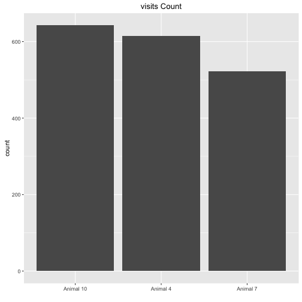
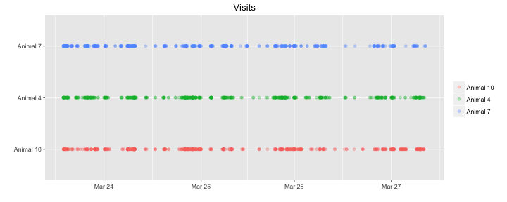
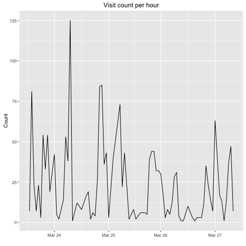
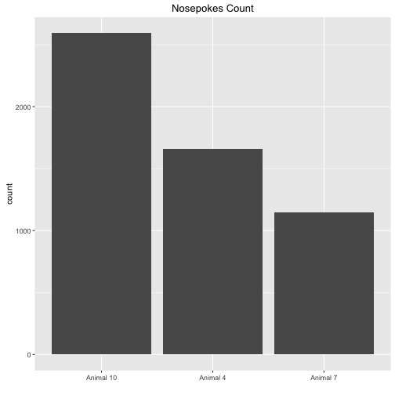
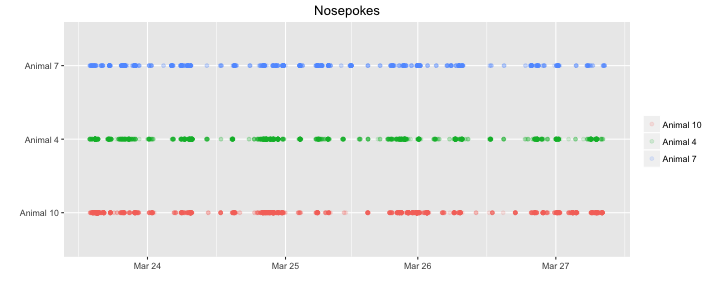

IntelliLog20160323
===================

This a log for a free adaptation which started on the 23/03/2016 with  
Wild type mice.

This R markdown requires ggplot2 package and will install it if it doesn't exist.  


It read the "animals.txt", "visits.txt" and "nosepokes.txt" files,    

and assigns animal name for each event as a factor(visit and nosepoke).  


This is the visit count with the appropriate plot  

```r
#Plots visit count per animal
visitsCountPlot <- ggplot(visits, aes(AnimalName)) +
                   geom_bar() +
                   xlab("") +
                   ggtitle("visits Count")
print(table(visits$AnimalName))
```

```
## 
## Animal 10  Animal 4  Animal 7 
##       643       615       522
```

```r
plot(visitsCountPlot)
```



Visits over time for each animal   

```r
#plot visits over time using the ggplot2 package
visitPoints <- geom_point(aes(x = as.POSIXct(visits$Start),
                              y = visits$AnimalName,
                              colour = visits$AnimalName),
                              alpha = 0.3)
visitPointsPlot <- ggplot() +
                   visitPoints +
                   xlab("") +
                   ylab("") +
                   ggtitle("Visits") +
                   theme(legend.title=element_blank())
plot(visitPointsPlot)
```



Visit count across absoulute time  

```r
#create a data frame for visit per hour
hours <- vapply(split(1:nrow(visits),
                      format(as.POSIXlt(visits$Start),"%Y-%m-%d%H:00:00",tz='UTC')),
                      length,
                      0)
visitsPerHour <- as.numeric(hours)
hour <- as.POSIXct(names(hours))
visitCount <- data.frame(hour,visitsPerHour)
#Plot a line plot for the visitCount data frame
visitCountLine <- ggplot(visitCount, aes(hour, visitsPerHour)) +
                  geom_line() +
                  ylab("Count") +
                  xlab("") +
                  ggtitle("Visit count per hour")
plot(visitCountLine)
```



This is the hour with the maximun number of visits  

```r
print(visitCount$hour[which.max(visitCount$visitsPerHour)])
```

```
## [1] "2016-03-24 07:00:00 IST"
```


This is the nosepokes count with the appropriate plot 

```r
#Plots nosepoke count per animal
nosepokesCountPlot <- ggplot(nosepokes, aes(AnimalName)) +
                      geom_bar() +
                      xlab("") +
                      ggtitle("Nosepokes Count")
print(table(nosepokes$AnimalName))
```

```
## 
## Animal 10  Animal 4  Animal 7 
##      2595      1659      1149
```

```r
plot(nosepokesCountPlot)
```




Nosepokes over time for each animal

```r
#Plot Nosepokes over time using the ggplot2 package
nosepokePoints <- geom_point(aes(x = as.POSIXct(nosepokes$Start),
                                 y = nosepokes$AnimalName,
                                 colour = nosepokes$AnimalName),
                                 alpha = 0.15)
nosepokesPointsPlot <- ggplot() +
                       nosepokePoints +
                       xlab("") +
                       ylab("") +
                       ggtitle("Nosepokes") +
                       theme(legend.title=element_blank())
plot(nosepokesPointsPlot)
```




  

