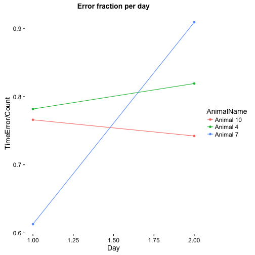

TrainingLog20160401
=======================

This is a log for the first training session with wild types, no injections, the door can be opened when nosepoked in the time window of 19:00-23:59, but only after a light cue appears between 2-4s after a visit occours.

This R markdown requires ggplot2 package and will install it if it doesn't exist.  


It read the "animals.txt", "visits.txt" and "nosepokes.txt" files,    

and assigns animal name for each event as a factor(visit and nosepoke).  


This is the visit count with the appropriate plot  

```
## 
## Animal 10  Animal 4  Animal 7 
##       491       563        98
```


Visits over time for each animal   


Visit count across absoulute time  


This is the hour with the maximun number of visits  

```
## [1] "2016-04-01 20:00:00 IDT"
```


This is the nosepokes count with the appropriate plot 

```
## 
## Animal 10  Animal 4  Animal 7 
##      1372      1297       270
```


Nosepokes over time for each animal


Check that drinking occoured only in the 19:00 23:59 time window, it shows the nosepokes where atleast one lick had happend, horizontal lines show the time window were the corner is active.


This is a plot showing the amount of nosepokes in the time window per day per animal  


This is the count of nosepokes per day per animal in the time windows


This is a plot showing the fraction of errors per time window.


```
##   AnimalName Day Count TimeError
## 1  Animal 10   1   343       240
## 2   Animal 4   2   351       270
## 3   Animal 7   1   163        88
## 4  Animal 10   2   446       287
## 5   Animal 4   1   368       252
## 6   Animal 7   2    25        23
```
The data shows that there are times when they succeed in the task, but do not lick, or that the lickometer doesn't record the licking. We are trying to make the task easier so they could learn and drink.  
