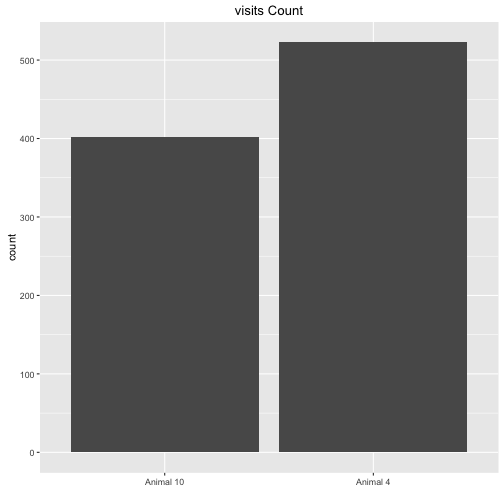
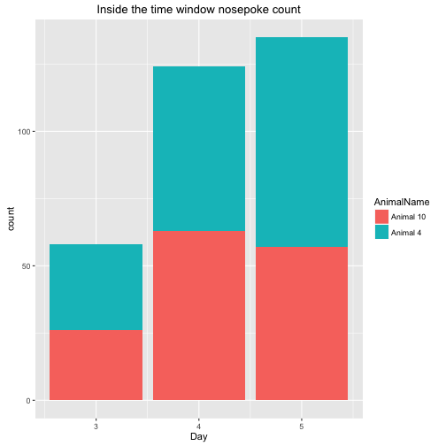
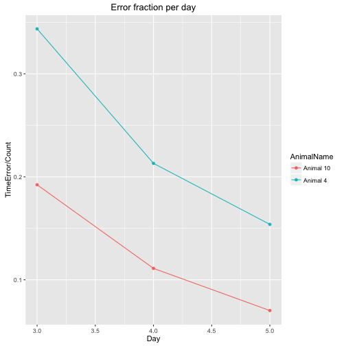
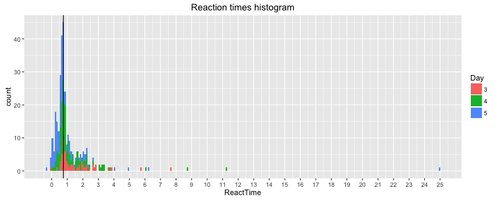

DelayCueAdaptLog20160403
=======================

This is a log for the first training session with wild types, no injections, the door can be opened when nosepoked in the time window of 19:00-23:59, but only after a light cue appears(for 2s) 0.5s after a visit occours.

This script attaches the sessions from the 03/04 to 05/04 because they have almost been the same, except that on the 3rd the door didn't close automatically after 3s, only when the visit ended.

This R markdown requires ggplot2 package and will install it if it doesn't exist.  


It read the "animals.txt", "visits.txt" and "nosepokes.txt" files, removes all non-first nosepokes    

and assigns animal name for each event as a factor(visit and nosepoke).  


This is the visit count with the appropriate plot  

```
## 
## Animal 10  Animal 4 
##       402       523
```



Visits over time for each animal   


Visit count across absoulute time  


This is the hour with the maximun number of visits  

```
## [1] "2016-04-05 07:00:00 IDT"
```


This is the nosepokes count with the appropriate plot 

```
## 
## Animal 10  Animal 4 
##       297       408
```


Nosepokes over time for each animal


Check that drinking occoured only in the 19:00 23:59 time window, it shows the nosepokes where atleast one lick had happend, horizontal lines show the time window were the corner is active.


This is a plot showing the amount of nosepokes in the time window per day per animal  


This is the count of nosepokes per day per animal in the time windows


This is a plot showing the fraction of errors per time window.


```
##   AnimalName Day Count TimeError
## 1  Animal 10   3    26         5
## 2   Animal 4   3    32        11
## 3  Animal 10   4    63         7
## 4   Animal 4   4    61        13
## 5  Animal 10   5    57         4
## 6   Animal 4   5    78        12
```

This is an histogram showing the reaction times(values under zero are nosepokes before the light cue) by day:  


```
## [1] "The median reaction time in seconds:0.75"
```
This is an histogram showing the reaction times(values under zero are nosepokes before the light cue) by animal:


## Conclusion
It seems that the animals have learnd to associate the light cue with the possibilty to open the door.
