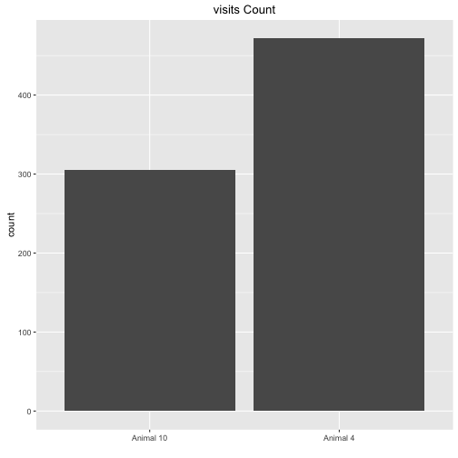
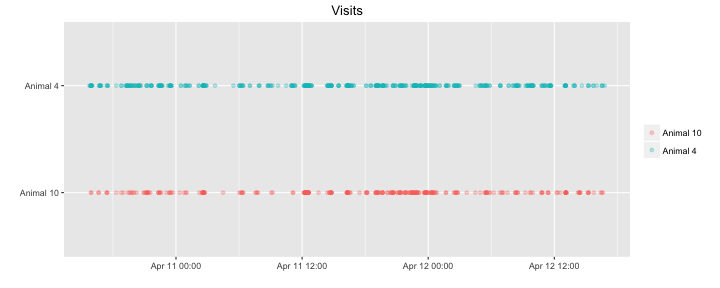
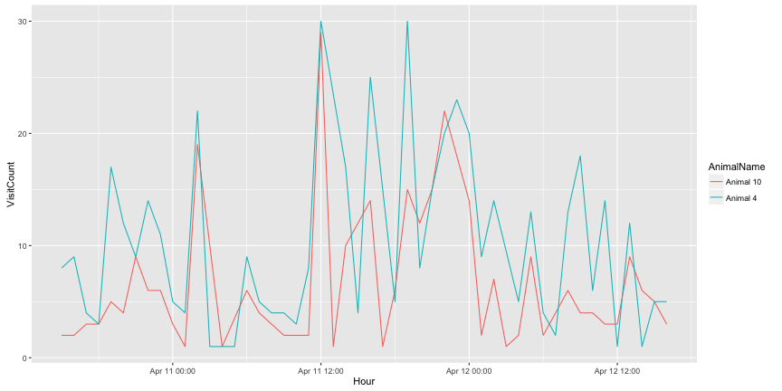
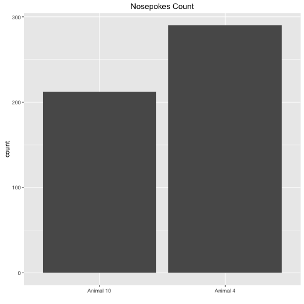
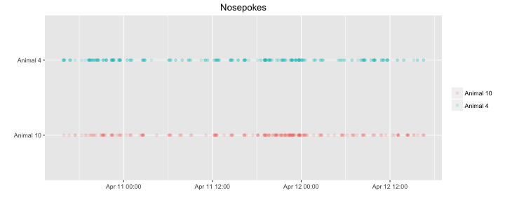
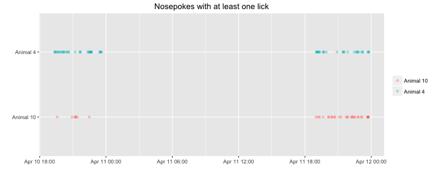
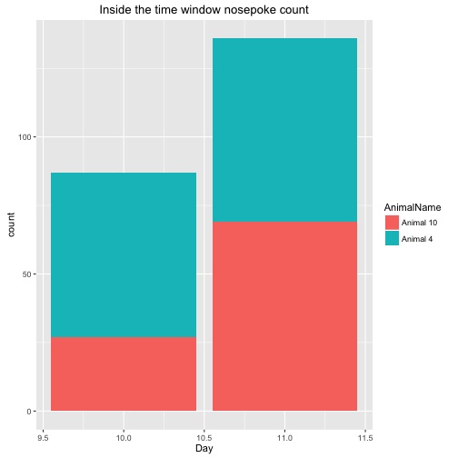
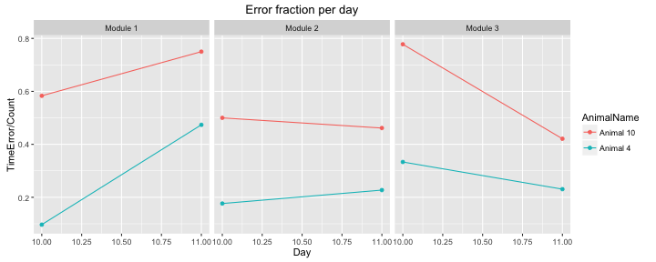
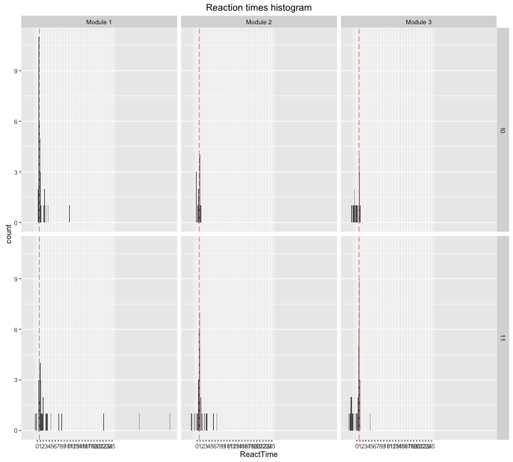
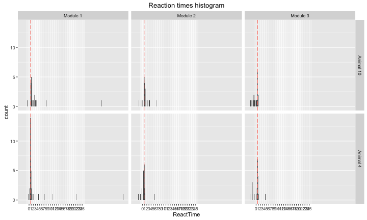

TaskTrainingLog20160410
=======================

This is a log for the task training session, the Anticipation time = {1s,2s,3s} is randomized, a light cue appears for 0.5s and since it appears there is a 1s chance for a nosepoke, this is the 4th and the 5th day of the training. 


This R markdown requires ggplot2 package and will install it if it doesn't exist.  


It read the "animals.txt", "visits.txt" and "nosepokes.txt" files, removes all non-first nosepokes    

and assigns animal name for each event as a factor(visit and nosepoke).  


This is the visit count with the appropriate plot  

```
## 
## Animal 10  Animal 4 
##       305       472
```



Visits over time for each animal   


Visit count across absoulute time  





This is the hour with the maximun number of visits  

```
## [1] "2016-04-11 12:00:00 IDT"
```


This is the nosepokes count with the appropriate plot 

```
## 
## Animal 10  Animal 4 
##       212       290
```




Nosepokes over time for each animal


Check that drinking occoured only in the 19:00 23:59 time window, it shows the nosepokes where atleast one lick had happend, horizontal lines show the time window were the corner is active.



This is a plot showing the amount of nosepokes in the time window per day per animal  


This is the count of nosepokes per day per animal in the time windows


This is a plot showing the fraction of errors per time window per module,
the number of the module corresponds the anticipation time in seconds.


```
##    AnimalName Day ModuleName Count TimeError
## 1   Animal 10  10   Module 1    12         7
## 2    Animal 4  10   Module 2    17         3
## 3   Animal 10  10   Module 3     9         7
## 4    Animal 4  10   Module 1    31         3
## 5   Animal 10  10   Module 2     6         3
## 6    Animal 4  10   Module 3    12         4
## 7   Animal 10  11   Module 1    24        18
## 8    Animal 4  11   Module 2    22         5
## 9   Animal 10  11   Module 3    19         8
## 10   Animal 4  11   Module 1    19         9
## 11  Animal 10  11   Module 2    26        12
## 12   Animal 4  11   Module 3    26         6
```

This is an histogram showing the reaction times(values under zero are nosepokes before the light cue) by Day by anticipation time, the salmon colored line is the overall median reaction time:


```
## [1] "The median reaction time in seconds:0.720000028610229"
```
This is an histogram showing the reaction times(values under zero are nosepokes before the light cue) by animal by anticipation time, the salmon colored line is the overall median reaction time:


## Conclusion
It seesms like the mice learned to wait and do associate the light cue with the possibility to open the door, although it is hard for them to react quickly in the 1s anticipation time.
