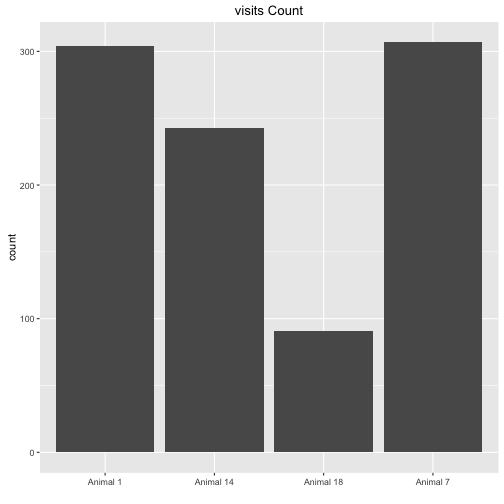
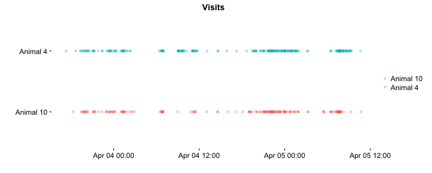
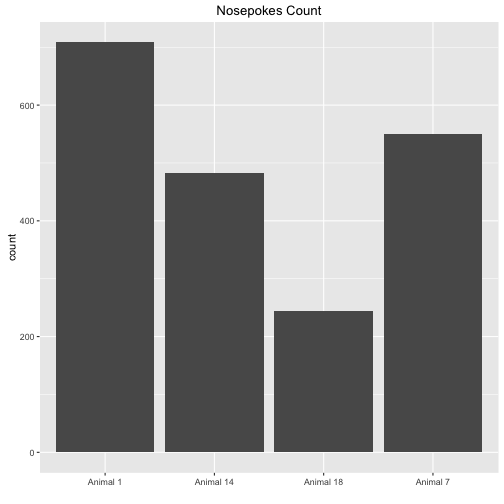
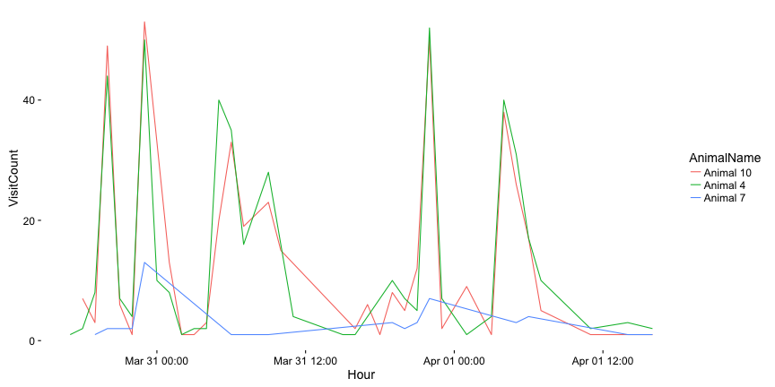

IntelliLogYYYYMMDD
===================

This is an example of an R Markdown document I've made to encapsulate
the analysis code and plots for the basic log files we will produce from the intellicage.
after each session a same log will be produced and save in the log folder.

This R markdown requires ggplot2 package and will install it if it doesn't exist.  


It read the "animals.txt", "visits.txt" and "nosepokes.txt" files,    

and assigns animal name for each event as a factor(visit and nosepoke).  


This is the visit count with the appropriate plot  

```
## 
##  Animal 1 Animal 14 Animal 18  Animal 7 
##       304       243        91       307
```



Visits over time for each animal  


This is the nosepokes count with the appropriate plot 

```
## 
##  Animal 1 Animal 14 Animal 18  Animal 7 
##       709       482       244       550
```




Nosepokes over time for each animal



  

