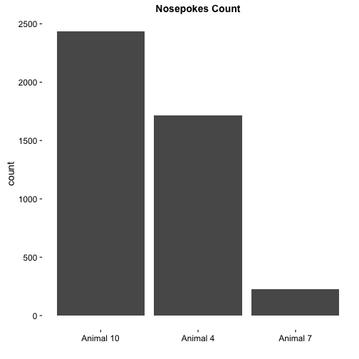
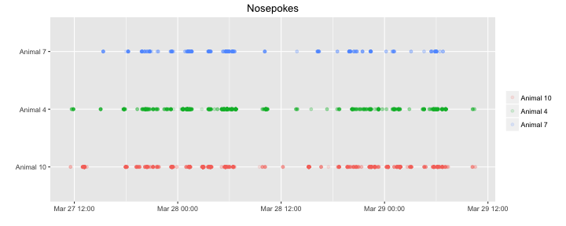
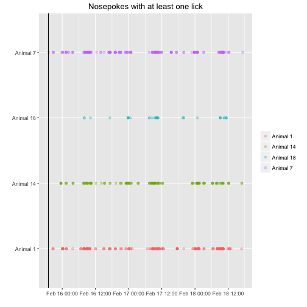
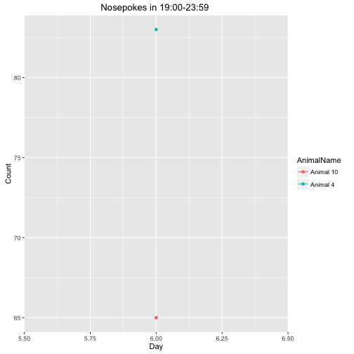

nosepokeAdapLog20160330
=======================

This is a log for the first nosepoke adaptation with wild types, no injections * with * light cue, the door can be opened when nosepoked in the time window of 19:00-23:59

This R markdown requires ggplot2 package and will install it if it doesn't exist.  


It read the "animals.txt", "visits.txt" and "nosepokes.txt" files, from both the 30 and 31 and attaches them, cause there has been a malfunction in the morning of the 31 which caused a split into two session folders.    

and assigns animal name for each event as a factor(visit and nosepoke).  


This is the visit count with the appropriate plot  

```
## 
## Animal 10  Animal 4  Animal 7 
##       438       475        44
```


Visits over time for each animal   


Visit count across absoulute time  


This is the hour with the maximun number of visits  

```
## [1] "2016-03-30 23:00:00 IDT"
```


This is the nosepokes count with the appropriate plot 

```
## 
## Animal 10  Animal 4  Animal 7 
##      2436      1717       226
```




Nosepokes over time for each animal


Check that drinking occoured only in the 19:00 23:59 time window, it shows the nosepokes where atleast one lick had happend, horizontal lines show the time window were the corner is active.



This is a plot showing the amount of nosepokes in the time window per day per animal  


This is the count of nosepokes per day per animal in the time windows


```
##   AnimalName Day Count
## 1  Animal 10  30   417
## 2   Animal 4  31   227
## 3   Animal 7  30   110
## 4  Animal 10  31   202
## 5   Animal 4  30   216
## 6   Animal 7  31    76
```
